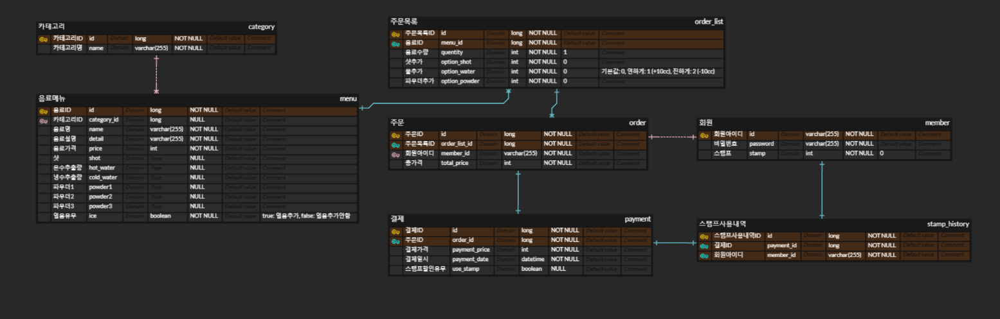

# 무인 카페 키오스크 만들기

24시 운영되는 무인 카페에서 사용하는 키오스크 서비스입니다.

## 프로젝트 기능 및 설계

- 카테고리 조회 기능
  - 모든 사용자는 카테고리를 조회할 수 있다.
  - 카테고리는 분류순서에 따라 조회된다.

- 음료 조회 기능
  - 모든 사용자는 음료를 조회할 수 있다.
  - 음료는 카테로리 별로 구분되어 조회된다.
  - 카테고리별 음료는 음료ID 순으로 정렬되며, 음료명, 음료가격이 조회된다.
  - paging처리 한다.

- 음료 상세화면 조회 기능
  - 모든 사용자는 음료 상세화면을 조회할 수 있다.
  - 음료 상세화면에서는 음료명, 음료가격, 음료 상세설명이 조회된다.

- 장바구니 요청 기능
  - 모든 사용자는 장바구니를 요청할 수 있다.
  - 음료 상세화면에서 음료수량을 입력받아 장바구니를 생성한다.
  - 장바구니에 대해 해당 키오스크의 키오스크ID를 가져온다.
  - 장바구니는 장바구니ID, 음료ID, 키오스크ID, 수량, 상태(결제대기, 결제완료)로 생성된다.

- 장바구니 조회 기능
  - 모든 사용자는 요청한 장바구니에 대해 조회할 수 있다.
  - 장바구니에서는 장바구니ID, 음료명, 음료가격, 음료수량, 총 가격이 조회된다.
  - 장바구니화면에서 간단하게 선택한 음료에 대해 수량을 조정하거나, 삭제할 수 있다.
  - 장바구니에 있는 항목에 대해 총 수량과 총 가격이 조회된다.
 
- 단골고객 회원가입 기능
  - 모든 사용자는 주문요청화면에서 단골고객 회원가입을 할 수 있다.
  - 스탬프 기능 (10개의 스탬프 적립 시 선택한 주문 중 가장 비싼 음료 1개 무료)을 이용할 수 있는 단골고객으로 회원가입 할 수 있다.
  - 회원가입 시 회원아이디, 비밀번호를 입력받으며, 회원아이디는 unique 해야한다.

- 단골고객 로그인 기능
  - 사용자는 주문요청화면에서 단골고객 로그인을 할 수 있다.
  - 회원가입 시 입력한 아이디와 비밀번호가 일치해야한다.
 
- 단골고객 조회 기능
  - 단골고객은 로그인 시 정보를 조회할 수 있다.
  - 조회 시 회원의 스탬프 개수와 할인가능 음료개수가 조회된다.

- 주문 요청 기능
  - 모든 사용자는 선택한 장바구니를 주문으로 생성할 수 있다. 만약 장바구니가 비어있으면 요청이 불가하다.
  - 주문에 대해 해당 키오스크의 키오스크ID를 가져온다.
  - 주문은 주문ID, 키오스크ID, 주문목록, 상태(결제대기, 결제완료)로 생성된다.

- 주문 조회 기능
  - 모든 사용자는 선택한 주문에 대해 주문 조회를 할 수 있다.
  - 주문 조회에서는 주문ID, 주문목록, 총 수량, 총 가격이 조회된다.

- 결제 요청 기능
  - 사용자가 선택한 주문에 대해 결제를 생성한다.
  - 결제하기 버튼을 누르면 결제수단을 선택할 수 있다. (결제수단은 카드결제만 존재한다고 가정한다.)
  - 결제는 결제ID, 키오스크ID, 주문ID, 회원아이디(로그인하지 않았다면 'AnonymousUser'), 스탬프 사용개수, 총가격, 할인가격, 결제가격, 결제수단, 결제일시, 승인일시, 상태(결제대기, 결제완료), 할인유무로 생성된다.
  - 결제가격과 스탬프사용유무는 아래의 스탬프 사용 정책을 따른다.
    - 스탬프 사용 정책
      - 스탬프 개수가 10개 이상일 경우에만 스탬프를 사용할 수 있다. 스탬프는 10개 이상일 경우 자동으로 소진된다. 스탬프 10개당 1잔 할인을 받는다.
      - 스탬프 사용 시 주문목록에서 가장 비싼 음료의 가격이 제외되어 결제가격이 설정된다.
      - 스탬프를 사용하여 무료로 결제한 음료에 대해서는 스탬프가 적립되지 않는다.
      - 스탬프는 음료 1개당 1개씩 적립된다고 정의한다.
     
- 결제 승인 요청 기능
  - 결제에 대해 승인 요청을 한다.
  - 승인 요청 시에는 키오스크ID와 카드번호를 입력받는다.
  - 카드번호는 미리 설정해놓은 카드로만 승인된다고 가정한다.
    - 설정되어있는 카드 목록 : 1111_1111_1111_1111 : 체크카드, 사용가능 / 2222_2222_2222_2222 : 신용카드, 사용가능 / 3333_3333_3333_3333 : 체크카드, 거래정지 / 4444_4444_4444_4444 : 신용카드, 거래정지
        
- 관리자 로그인 기능
  - 관리자 권한을 가진 아이디와 비밀번호로 관리자 로그인이 가능하다.
  - 관리자 권한은 DB에서 설정하는 것으로 정의한다.

- 관리자 카테고리 추가기능
  - 관리자는 카테고리를 추가할 수 있다.
  - 카테고리는 카테고리 ID, 카테고리 명으로 생성된다.
  - 
- 관리자 카테고리 조회기능
  - 관리자는 모든 카테고리를 조회할 수 있다.
  - 카테고리는 카테고리 ID, 카테고리 명, 분류순서, 사용여부로 조회된다.

- 관리자 음료 추가기능
  - 관리자는 음료를 추가할 수 있다.
  - 음료는 음료ID, 카테고리ID, 음료명, 음료가격, 음료설명, 샷, 온수추출량, 냉수추출량, 파우더 1, 파우더 2, 파우더 3, 얼음유무를 입력받아 생성한다.
  - 모든 음료의 SIZE는 같다고 가정한다.
  - 모든 음료의 추가사항은 없다고 가정한다.
  - 같은 음료의 HOT/ICE 경우는 관리자가 생성 시 분류하여 생성한다고 가정한다.
 
- 관리자 음료 조회기능
  - 관리자는 모든 음료를 조회할 수 있다.
  - 음료는 음료ID, 카테고리ID, 음료명, 음료가격, 음료설명, 샷, 온수추출량, 냉수추출량, 파우더 1, 파우더 2, 파우더 3, 얼음유무로 조회된다.

- 관리자 매출조회 기능
  - 매출은 결제완료 상태의 결제 데이터에서 가져온다.
  - 관리자는 발생한 매출에 대해 오늘, 일별, 월별, 년별 조회할 수 있다.
  - 매출조회에서는 총 매출액을 조회한다.

- 관리자 무료시음 기능
  - 관리자는 무료시음을 위해 무료시음 기능을 사용할 수 있다.
  - 무료시음 기능을 사용하면 등록된 결제데이터를 비용 없이 추출 가능하다.

- 관리자 스탬프 사용이력 조회 기능
  - 관리자는 회원들의 스탬프 사용이력을 조회할 수 있다.
  - 결제완료 상태의 결제 데이터에 대해 생성된다.
  - 스탬프 사용이력 데이터는 스탬프변경이력ID, 키오스크ID, 결제ID, 회원아이디, 변경 전 스탬프 개수, 변경 후 스탬프 개수가 생성된다.

## ERD 

## Trouble Shooting

### Tech Stack
- IntelliJ IDEA 2024.1.4 (Community Edition)
- Java : 11
- Spring : version 2.5.4
  - Gradle
  - Dependencies
    - Lombok
    - Spring Security
    - Devtools
    - JDBC
    - Thymeleaf
- Mysql : version 8.0.38 community
- Git

 
   
   
   
   
  

