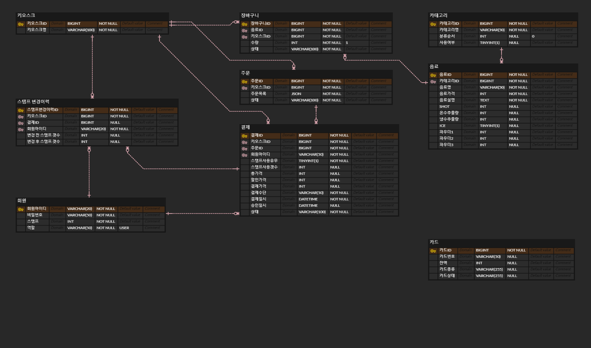

# 무인 카페 키오스크 만들기

24시 운영되는 무인 카페에서 사용하는 키오스크 서비스입니다.

## 프로젝트 기능 및 설계

- 음료 조회 기능
  - 모든 사용자는 음료를 조회할 수 있다.
  - 음료는 카테로리 별로 구분되어 조회된다.
  - 카테고리별 음료는 음료ID 순으로 정렬되며, 음료명, 음료가격이 조회된다.
- 음료 상세화면 조회 기능
  - 모든 사용자는 음료 상세화면을 조회할 수 있다.
  - 음료 조회화면에서 음료를 선택하면 음료 상세화면으로 전환된다.
  - 음료 상세화면에서는 음료명, 음료가격, 음료 상세설명이 조회된다.
- 주문목록 요청 기능
  - 모든 사용자는 주문목록을 요청할 수 있다.
  - 음료 상세화면에서 음료수량, 음료 추가사항 (SHOT 추가, 물 추가, 파우더 추가) 를 입력받아 주문목록을 생성한다.
- 주문목록 조회 기능
  - 모든 사용자는 요청한 주문목록에 대해 조회할 수 있다.
  - 주문목록에서는 주문NO, 음료명, 음료수량, 음료가격이 조회된다.
  - 주문목록화면에서 간단하게 선택한 음료에 대해 수량을 조정하거나, 삭제할 수 있다.
  - 주문목록에 있는 항목에 대해 총 수량과 총 가격이 조회된다.
- 주문 요청 기능
  - 모든 사용자는 선택한 주문목록을 주문으로 생성할 수 있다. 만약 주문목록이 비어있으면 요청이 불가하다. 
  - 주문은 주문번호, 주문시간, 총 가격으로 생성된다.
- 결제 조회 기능
  - 모든 사용자는 선택한 주문목록에 대해 결제 조회를 할 수 있다.
  - 결제 조회에서는 주문NO, 음료명, 음료수량, 추가사항, 음료 가격, 총 수량, 총 가격이 조회된다.
- 단골고객 회원가입 기능
  - 스탬프 기능 (10개의 스탬프 적립 시 선택한 주문 중 가장 비싼 음료 1개 무료)을 이용할 수 있는 단골고객으로 회원가입 할 수 있다.
  - 회원가입 시 회원아이디, 비밀번호를 입력받으며, 회원아이디는 unique 해야한다.
- 단골고객 로그인 기능
  - 사용자는 결제화명에서 단골고객 로그인을 할 수 있다.
  - 회원가입 시 입력한 아이디와 비밀번호가 일치해야한다.
- 스탬프 보유수량 조회 기능
  - 단골고객 로그인을 한 사용자에 한해, 결제화면에서 현재 보유한 스탬프의 개수를 조회할 수 있다.
- 결제 요청 기능
  - 사용자가 선택한 주문 목록에 대해 결제를 생성한다.
  - 모든 결제 요청에 대해서는 승인한다고 가정한다.
  - 결제는 결제ID, 주문ID, 결제가격, 결제일시, 스탬프 사용 유무로 생성된다.
- 결제 완료 조회 기능
  - 결제가 완료되면 주문번호와 주문목록이 조회된다.
  - 또한, 기계에 요청값을 준다고 가정하고, 화면에 선택된 모든 음료의 샷, 온수추출량, 냉수추출량, 파우더 1, 파우더 2, 파우더 3, 얼음유무, 샷추가, 물추가, 파우더추가 사항을 출력한다.
- 관리자 로그인 기능
  - 관리자 권한을 가진 아이디와 비밀번호로 관리자 로그인이 가능하다.
  - 관리자 권한은 DB에서 설정하는 것으로 정의한다.
- 관리자 카테고리 추가기능
  - 관리자는 카테고리를 추가할 수 있다.
  - 카테고리는 카테고리 ID, 카테고리 명으로 생성된다.
- 관리자 음료 추가기능
  - 관리자는 음료를 추가할 수 있다.
  - 음료는 음료ID, 카테고리ID, 음료명, 음료설명, 음료가격, 샷, 온수추출량, 냉수추출량, 파우더 1, 파우더 2, 파우더 3, 얼음유무를 입력받아 생성한다.
  - 모든 음료의 SIZE는 같다고 가정한다.
- 관리자 매출조회 기능
  - 관리자는 발생한 매출에 대해 일별, 월별, 년별 조회할 수 있다.
  - 매출조회에서는 총 매출액, 음료별 매출액을 조회한다.
- 관리자 무료시음 기능
  - 관리자는 무료시음을 위해 무료시음 기능을 사용할 수 있다.
  - 무료시음 기능을 사용하면 등록된 모든 음료를 결제 없이 추출 가능하다.
- 관리자 회원 관리 기능
  - 관리자는 모든 회원을 조회할 수 있다.
  - 모든 회원의 스탬프 개수를 조정할 수 있다.
- 관리자 스탬프 히스토리 조회 기능
  - 관리자는 회원의 스탬프 사용내역을 조회할 수 있다.

## ERD 

## Trouble Shooting

### Tech Stack
- IntelliJ IDEA 2024.1.4 (Community Edition)
- Java : 11
- Spring : version 2.5.4
  - Gradle
  - Dependencies
    - Lombok
    - Spring Security
    - Devtools
    - JDBC
    - Thymeleaf
- Mysql : version 8.0.38 community
- Git

 
   
   
   
   
  

